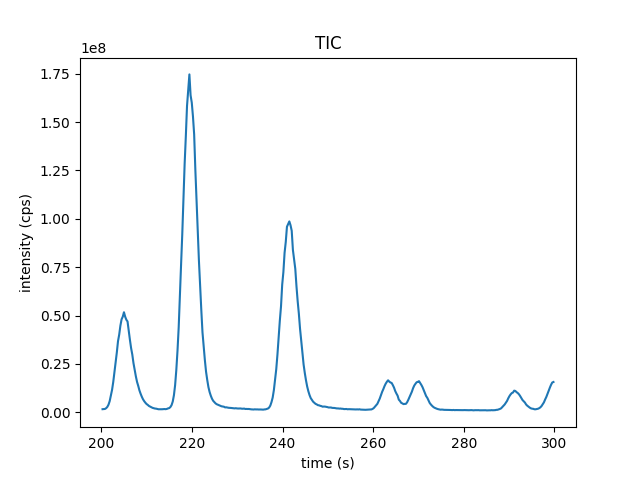

Import pyOpenMS
===============

After installation, you should be able to import pyOpenMS as a package

.. code-block:: python

    import pyopenms

which should now give you access to all of pyOpenMS. You should now be able to
interact with the OpenMS library and, for example, read and write :term:`mzML` files:

.. code-block:: python

    import pyopenms as oms

    exp = oms.MSExperiment()
    oms.MzMLFile().store("testfile.mzML", exp)

which will create an empty :term:`mzML` file called `testfile.mzML`.

Using the Help Function
=======================

There are multiple ways to get information about the available functions and
methods. We can inspect individual pyOpenMS objects through the ``Python`` ``help``
function:

.. code-block:: python

    help(oms.MSExperiment)

.. code-block:: output

    class MSExperiment(pyopenms._pyopenms_kernel.ExperimentalSettings)
     |  MSExperiment(*args, **kwargs)
     |
     |  In-Memory representation of a mass spectrometry experiment.
     |  Contains the data and metadata of an experiment performed with an MS (or
     |  HPLC and MS). This representation of an MS experiment is organized as list
     |  of spectra and chromatograms and provides an in-memory representation of
     |  popular mass-spectrometric file formats such as mzXML or mzML. The
     |  meta-data associated with an experiment is contained in
     |  ExperimentalSettings (by inheritance) while the raw data (as well as
     |  spectra and chromatogram level meta data) is stored in objects of type
     |  MSSpectrum and MSChromatogram, which are accessible through the getSpectrum
     |  and getChromatogram functions.
     |  Spectra can be accessed by direct iteration or by getSpectrum(),
     |  while chromatograms are accessed through getChromatogram().
     |  See help(ExperimentalSettings) for information about meta-data.

     [...]

     |  Method resolution order:
     |      MSExperiment
     |      pyopenms._pyopenms_kernel.ExperimentalSettings
     |      builtins.object
     |
     |  Methods defined here:

     [...]

which lists information on the :py:class:`~.MSExperiment` class, including a
description of the main purpose of the class and how the class is intended to
be used. The base classes of :py:class:`~.MSExperiment`, which contain further
information, are named in the first line of the output and in the
``Method resolution order`` section.
The list of available methods is long and reveals that the class exposes methods such as
:py:meth:`~.MSExperiment.getNrSpectra` and :py:meth:`~.MSExperiment.getSpectrum(id)` where the argument ``id`` is
the index of the spectrum; the methods inherited from the base classes follow at the end,
under ``Methods inherited from``. The command also lists the signature for each
function, allowing users to identify the function arguments and return types.
We can gain further information about exposed methods by investigating the
documentation of the base classes:

.. code-block:: python

    help(oms.ExperimentalSettings)

.. code-block:: output

    Help on class ExperimentalSettings in module pyopenms._pyopenms_kernel:

    class ExperimentalSettings(builtins.object)
     |  ExperimentalSettings(*args, **kwargs)
     |
     |  Description of the experimental settings, provides meta-information
     |  about an LC-MS/MS injection.
     |
     |  Methods defined here:

     [...]

In C++, :py:class:`~.ExperimentalSettings` in turn derives from :py:class:`~.DocumentIdentifier`
and :py:class:`~.MetaInfoInterface`. pyOpenMS exposes their methods (for example
``getIdentifier`` and ``getMetaValue``) directly on :py:class:`~.ExperimentalSettings`, so
they are part of its list of methods. For a more complete documentation of the underlying
wrapped methods, please consult the official OpenMS documentation, in this case
the `MSExperiment documentation <https://archive.openms.de/openms/Documentation/release/latest/html/classOpenMS_1_1MSExperiment.html>`_.

First Look at Data
==================

File Reading
************

pyOpenMS supports a variety of different files through the implementations in
OpenMS. In order to read mass spectrometric data, we can download the :term:`mzML`
example file:

.. code-block:: python

    from urllib.request import urlretrieve

    # download small example file
    gh = "https://raw.githubusercontent.com/OpenMS/OpenMS/develop/doc/pyopenms"
    urlretrieve(gh + "/src/data/tiny.mzML", "tiny.mzML")
    exp = oms.MSExperiment()
    # load example file
    oms.MzMLFile().load("tiny.mzML", exp)

which will load the content of the ``tiny.mzML`` file into the ``exp``
variable of type :py:class:`~.MSExperiment`.
We can now inspect the properties of this object:

.. code-block:: python

    help(exp)

.. code-block:: output

    class MSExperiment(pyopenms._pyopenms_kernel.ExperimentalSettings)
     |  MSExperiment(*args, **kwargs)

     [...]

     |  Methods defined here:

     [...]

     |  getNrChromatograms(...)
     |      getNrChromatograms(self) -> int
     |
     |      Returns the number of chromatograms
     |
     |  getNrSpectra(...)
     |      getNrSpectra(self) -> int
     |
     |      Returns the number of MS spectra
     |

     [...]

which indicates that the variable ``exp`` has (among others) the functions
:py:class:`~.MSExperiment.getNrSpectra` and :py:class:`~.MSExperiment.getNrChromatograms`. We can now try these functions:

.. code-block:: python

    print(exp.getNrSpectra())
    print(exp.getNrChromatograms())

.. code-block:: output
    
    4
    2

and indeed we see that we get information about the underlying :term:`MS` data.

File Summary
************

To get an overview of a whole file, use :py:class:`~.FileInfo`, the library
version of the ``FileInfo`` :term:`TOPP` tool. :py:meth:`~.FileInfo.run`
determines the file type, loads the file and returns the collected information:

.. code-block:: python
    :linenos:

    result = oms.FileInfo().run("tiny.mzML")

    print("File type:", result.meta.file_type_name)
    print("Spectra:", result.peak.num_spectra)
    print("Spectra per MS level:", result.peak.spectra_per_ms_level)
    ranges = result.ranges.spectra_overall
    print("RT:", ranges.rt.min, "to", ranges.rt.max)
    print("m/z:", ranges.mz.min, "to", ranges.mz.max)

.. code-block:: output

    File type: mzML
    Spectra: 4
    Spectra per MS level: {1: 3, 2: 1}
    RT: -1.0 to 359.43
    m/z: 0.0 to 18.0

``result.peak`` describes a peak file such as :term:`mzML`; for other file
types, another part such as ``result.feature``, ``result.ident`` or
``result.fasta`` is set instead, and the parts that do not apply are ``None``.
``result.ranges`` also holds the ranges per :term:`MS` level
(``per_ms_level``), of the chromatograms (``chromatograms``) and of both
together (``combined``). The retention time range starts at -1 because the
third spectrum of ``tiny.mzML`` has no retention time, and OpenMS stores a
missing retention time as -1.

:py:meth:`~.FileInfo.to_text` returns the report that the ``FileInfo`` tool
prints (also stored in ``result.text``), and :py:meth:`~.FileInfo.to_tsv` its
tab-separated version. These are the first lines of the report:

.. code-block:: python
    :linenos:

    report = oms.FileInfo.to_text(result)
    print("\n".join(report.strip().splitlines()[:11]))

.. code-block:: output

    -- General information --

    File name: tiny.mzML
    File type: mzML

    Instrument: LCQ Deca
      Mass Analyzer: Quadrupole ion trap (resolution: 0)

    MS levels: 1, 2
    Total number of peaks: 65
    Number of spectra: 4

The report continues with the ranges, the spectra per :term:`MS` level, the
activation methods, the precursor charges and the chromatograms. To add
sections, pass a ``FileInfo.Options`` object as second argument to ``run()``;
for example, ``meta = True`` adds sample, instrument and contact information.
:py:meth:`~.FileInfo.run_all` adds this, the data processing information and
summary statistics. With ``validate = True``, ``run()`` validates the file
instead of summarizing it.

Iteration
*********

We can iterate through the spectra as follows:

.. note::

   Core classes such as :py:class:`~.MSSpectrum` and :py:class:`~.Peak1D`
   expose common scalar attributes as snake_case properties (e.g.
   ``spec.ms_level``, ``spec.rt``, ``peak.mz``, ``peak.intensity``). These are
   equivalent to the ``getX()`` / ``setX()`` methods, which still work.

.. code-block:: python

    for spec in exp:
        print("MS Level:", spec.ms_level)

.. code-block:: output

    MS Level: 1
    MS Level: 2
    MS Level: 1
    MS Level: 1

This iterates through all available :py:class:`~.MSSpectra`, we can also access spectra through the ``[]`` operator:

.. code-block:: python

    print("MS Level:", exp[1].ms_level)

.. code-block:: output

    MS Level: 2

Note that ``spec[1]`` will access the *second* spectrum (arrays start at
``0``). We can access the raw peaksthrough :py:meth:`~.MSSpectrum.get_peaks()`:

.. code-block:: python

    spec = exp[1]
    mz, intensity = spec.get_peaks()
    print(sum(intensity))
.. code-block:: output

    110

Which will access the data using a numpy array, storing the m/z information
in the mz vector and the intensity in the ``i`` vector. Alternatively, we
can also iterate over individual peaks objects as follows (this tends to be
slower):

.. code-block:: python

    for peak in spec:
        print(peak.intensity)

.. code-block:: output

    20.0
    18.0
    16.0
    14.0
    12.0
    10.0
    8.0
    6.0
    4.0
    2.0

Copies, Not References
**********************

pyOpenMS containers use **value semantics** for element access: every
object you retrieve is an independent copy. Whether you use indexing
(``exp[0]``), iteration (``for spec in exp:``) or a getter
(``exp.getSpectrum(0)``, ``spec.getPrecursors()``), the returned object
owns its own data. Editing it does not modify the container, and later
changes to the container do not affect objects retrieved earlier.

A common pitfall follows directly from this: editing the copy does *not*
edit the experiment.

.. code-block:: python

    spec = exp[0]
    spec.setRT(999.9)      # edits only our copy
    print(exp[0].getRT())  # the experiment is unchanged

.. code-block:: output

    353.43

To change data inside a container, follow the pattern
**read it, edit it, put it back**:

.. code-block:: python

    spec = exp[0]        # read it
    spec.setRT(999.9)    # edit it
    exp[0] = spec        # put it back
    print(exp[0].getRT())

.. code-block:: output

    999.9

Why does pyOpenMS work this way? Because the alternative -- handing out
live references into the container's internal storage -- makes ordinary
code unsafe: appending a spectrum can reallocate the container's memory
and invalidate every previously returned object (a use-after-free), and
sorting would silently re-bind held objects to different elements. With
copies, nothing you hold ever becomes invalid.

Two things complete the picture:

* **The naming is the contract.** As a rule, anything called ``getX()`` or
  ``get_*`` returns a copy you own. The deliberate exceptions end in
  ``_view``, ``_views`` or ``_struct``: those return zero-copy *views* that
  alias the container's storage for speed -- edits through a view land
  immediately, but the view is only valid until the container is resized or
  sorted. Views are introduced in the `MS data <ms_data.html>`_ chapter.
* **Copies cost time on big objects.** For read-only sweeps over large
  experiments, iterate views instead of copies:
  ``for spec in exp.iter_spectrum_views(): ...``.

Total Ion Current Calculation
*****************************

Here, we will apply what we have learned to calculate the total ion current (TIC). The TIC represents the
summed intensity across the entire range of masses being detected at every point in the analysis. 
Basically, we calculate the total ion current of the whole experiment.

With this information, we can write a function that calculates the TIC for a given MS level:

.. code-block:: python

    # Calculates total ion current of an LC-MS/MS experiment
    def calcTIC(exp, mslevel):
        tic = 0
        # Iterate through all spectra of the experiment
        for spec in exp:
            # Only calculate TIC for matching (MS1) spectra
            if spec.getMSLevel() == mslevel:
                mz, i = spec.get_peaks()
                tic += sum(i)
        return tic

To calculate a TIC we would now call the function:

.. code-block:: python

    print(calcTIC(exp, 1))
    print(sum([sum(s.get_peaks()[1]) for s in exp if s.getMSLevel() == 1]))
    print(calcTIC(exp, 2))
.. code-block:: output

    240.0
    240.0
    110.0

Note how one can compute the same property using list comprehensions in Python
(see line number 3 in the above code which computes the TIC using filtering
properties of Python list comprehensions (``s.getMSLevel() == 1``) and computes
the sum over all peaks(right ``sum``) and the sum over all spectra (left
``sum``) to retrieve the TIC).

Total Ion Current Chromatogram
****************************************************

The total ion current is visualized over the retention time, to allow for the inspection
of areas with general high intensity (usually multiple analytes were measured there).
This can help the experimentalist to optimize the chromatography for a better
separation in a specific area.

While some :term:`mzML` files already contain a pre-computed total ion current chromatogram (TIC),
we will show you how to calculate the TIC for :term:`MS1`. One can access the retention times
and intensities of the TIC in different ways and generate a total ion current chromatogram
(2D graph) using ``matplotlib``:

.. code-block:: python
    :linenos:

    import matplotlib.pyplot as plt
    from urllib.request import urlretrieve

    # retrieve MS data
    gh = "https://raw.githubusercontent.com/OpenMS/OpenMS/develop/doc/pyopenms"
    urlretrieve(
        gh + "/src/data/FeatureFinderMetaboIdent_1_input.mzML", "ms_data.mzML"
    )

    # load MS data into MSExperiment()
    exp = oms.MSExperiment()
    oms.MzMLFile().load("ms_data.mzML", exp)

    # choose one of the following three methods to access the TIC data
    # 1) recalculate TIC data with the calculateTIC() function
    tic = exp.calculateTIC()
    retention_times, intensities = tic.get_peaks()

    # 2) get TIC data using list comprehensions
    retention_times = [spec.getRT() for spec in exp]
    intensities = [
        sum(spec.get_peaks()[1]) for spec in exp if spec.getMSLevel() == 1
    ]

    # 3) get TIC data looping over spectra in MSExperiment()
    retention_times = []
    intensities = []
    for spec in exp:
        if spec.getMSLevel() == 1:
            retention_times.append(spec.getRT())
            intensities.append(sum(spec.get_peaks()[1]))

    # plot retention times and intensities and add labels
    plt.plot(retention_times, intensities)

    plt.title("TIC")
    plt.xlabel("time (s)")
    plt.ylabel("intensity (cps)")

    plt.show()

