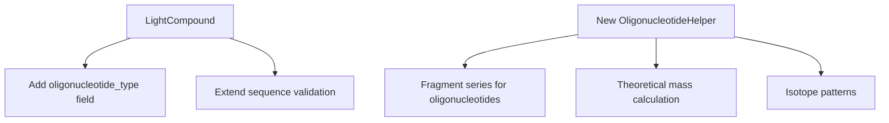

Based on my comprehensive analysis of the OpenSWATH codebase, I can now provide you with detailed findings about peptide/protein-specific types versus string storage, and recommendations for expanding support to oligonucleotides.

## Summary of Findings

### **Areas with Peptide/Protein-Specific Types**

**1. Core Sequence Handling:**
- [`AASequence`](src/openms/include/OpenMS/ANALYSIS/OPENSWATH/DIAHelper.h:11) class is extensively used throughout the codebase
- [`getBYSeries()`](src/openms/include/OpenMS/ANALYSIS/OPENSWATH/DIAHelper.h:96), [`getTheorMasses()`](src/openms/include/OpenMS/ANALYSIS/OPENSWATH/DIAHelper.h:103), and [`simulateSpectrumFromAASequence()`](src/openms/include/OpenMS/ANALYSIS/OPENSWATH/DIAHelper.h:116) functions are peptide-specific
- [`TargetedExperiment::Peptide`](src/openms/include/OpenMS/ANALYSIS/OPENSWATH/TransitionTSVFile.h:287) objects contain amino acid sequence information

**2. Fragment Ion Series Generation:**
- [`MRMIonSeries`](src/openms/include/OpenMS/ANALYSIS/OPENSWATH/MRMIonSeries.h:41) class generates b/y ion series specific to peptides
- [`getIonSeries()`](src/openms/include/OpenMS/ANALYSIS/OPENSWATH/MRMIonSeries.h:130) function with [`AASequence`](src/openms/include/OpenMS/ANALYSIS/OPENSWATH/MRMIonSeries.h:130) input
- Ion annotation using peptide-specific fragment types (a, b, c, x, y, z ions)

**3. Scoring Algorithms:**
- [`dia_by_ion_score()`](src/openms/include/OpenMS/ANALYSIS/OPENSWATH/DIAScoring.h:124) function specifically scores b/y ion presence
- Theoretical spectrum scoring using peptide fragment patterns
- Isotope pattern scoring based on amino acid composition

**4. Decoy Generation:**
- [`MRMDecoy`](src/openms/include/OpenMS/ANALYSIS/OPENSWATH/MRMDecoy.h:55) class with peptide sequence shuffling/reversing algorithms
- [`shufflePeptide()`](src/openms/include/OpenMS/ANALYSIS/OPENSWATH/MRMDecoy.h:132), [`reversePeptide()`](src/openms/include/OpenMS/ANALYSIS/OPENSWATH/MRMDecoy.h:146) functions
- [`AASequenceIdentity()`](src/openms/include/OpenMS/ANALYSIS/OPENSWATH/MRMDecoy.h:123) for sequence comparison

### **Areas with String-Based Storage (Oligonucleotide-Compatible)**

**1. Core Data Structures:**
- [`LightCompound.sequence`](src/openswathalgo/include/OpenMS/OPENSWATHALGO/DATAACCESS/TransitionExperiment.h:138) stored as `std::string`
- [`LightCompound.id`](src/openswathalgo/include/OpenMS/OPENSWATHALGO/DATAACCESS/TransitionExperiment.h:143), [`compound_name`](src/openswathalgo/include/OpenMS/OPENSWATHALGO/DATAACCESS/TransitionExperiment.h:147) as strings
- [`LightTransition.transition_name`](src/openswathalgo/include/OpenMS/OPENSWATHALGO/DATAACCESS/TransitionExperiment.h:21), [`peptide_ref`](src/openswathalgo/include/OpenMS/OPENSWATHALGO/DATAACCESS/TransitionExperiment.h:22) as strings

**2. File I/O and Data Exchange:**
- [`TransitionTSVFile`](src/openms/include/OpenMS/ANALYSIS/OPENSWATH/TransitionTSVFile.h:118) handles transitions with string-based sequence storage
- [`TransitionPQPFile`](src/openms/include/OpenMS/ANALYSIS/OPENSWATH/TransitionPQPFile.h:189) SQLite format uses text fields for sequences
- [`CompoundName`](src/openms/include/OpenMS/ANALYSIS/OPENSWATH/TransitionTSVFile.h:145), [`SMILES`](src/openms/include/OpenMS/ANALYSIS/OPENSWATH/TransitionTSVFile.h:146), [`SumFormula`](src/openms/include/OpenMS/ANALYSIS/OPENSWATH/TransitionTSVFile.h:147) fields for metabolomics

**3. Generic Workflow Components:**
- [`OpenSwathWorkflow`](src/openms/include/OpenMS/ANALYSIS/OPENSWATH/OpenSwathWorkflow.h:385) orchestration is sequence-agnostic
- Chromatogram extraction and RT normalization are generic
- Peak picking and feature detection algorithms
- Basic scoring metrics (correlation, mass accuracy, retention time)

## Recommendations for Oligonucleotide Support

### **1. Extend Core Data Structures**

**Create oligonucleotide-specific extensions:**
- Add an oligonucleotide sequence class similar to `AASequence` but for nucleotides
- Extend [`LightCompound`](src/openswathalgo/include/OpenMS/OPENSWATHALGO/DATAACCESS/TransitionExperiment.h:126) with oligonucleotide-specific metadata fields
- Add nucleotide modification support (methylation, phosphorothioate bonds, etc.)

### **2. Implement Oligonucleotide-Specific Scoring**

**Fragment Ion Series:**
- Create oligonucleotide equivalent of [`MRMIonSeries`](src/openms/include/OpenMS/ANALYSIS/OPENSWATH/MRMIonSeries.h:41) for a/b, c/d, w/x/y/z ion series
- Implement nucleotide-specific neutral losses (bases, phosphates)
- Add support for different ionization modes and charge states

**Theoretical Spectrum Generation:**
- Extend [`DIAHelper`](src/openms/include/OpenMS/ANALYSIS/OPENSWATH/DIAHelper.h:20) with oligonucleotide-specific functions
- Implement theoretical mass calculation for nucleotide sequences
- Add isotope pattern calculation for oligonucleotides

### **3. Modify Scoring Algorithms**

**Replace peptide-specific scoring:**
- Create oligonucleotide equivalent of [`dia_by_ion_score()`](src/openms/include/OpenMS/ANALYSIS/OPENSWATH/DIAScoring.h:124)
- Implement oligonucleotide-specific correlation scoring
- Add melting temperature and secondary structure considerations

**Extend existing generic scoring:**
- Most mass accuracy, retention time, and peak shape scoring can remain unchanged
- Isotope correlation scoring may need adjustment for nucleotide compositions

### **4. Decoy Generation Strategy**

**Oligonucleotide-specific decoys:**
- Extend [`MRMDecoy`](src/openms/include/OpenMS/ANALYSIS/OPENSWATH/MRMDecoy.h:55) with nucleotide sequence shuffling
- Implement sequence reversal respecting base-pairing rules
- Add support for maintaining secondary structure constraints

### **5. File Format Extensions**

**Extend existing formats:**
- [`TransitionTSVFile`](src/openms/include/OpenMS/ANALYSIS/OPENSWATH/TransitionTSVFile.h:118) already supports compound-based workflows through [`CompoundName`](src/openms/include/OpenMS/ANALYSIS/OPENSWATH/TransitionTSVFile.h:145) field
- Add oligonucleotide-specific metadata columns
- Extend [`TransitionPQPFile`](src/openms/include/OpenMS/ANALYSIS/OPENSWATH/TransitionPQPFile.h:189) database schema

### **6. Implementation Priority**

**Phase 1 (High Priority):**
1. Extend data structures for oligonucleotide metadata
2. Implement basic theoretical mass calculation
3. Create oligonucleotide fragment ion series generation

**Phase 2 (Medium Priority):**
1. Develop oligonucleotide-specific scoring algorithms
2. Implement decoy generation
3. Extend file format support

**Phase 3 (Lower Priority):**
1. Advanced secondary structure considerations
2. Complex modification support
3. Specialized visualization tools

The good news is that much of the OpenSWATH infrastructure (workflow orchestration, chromatogram handling, basic scoring, file I/O) is already generic enough to support oligonucleotides with minimal changes. The main work would be implementing the oligonucleotide-specific theoretical chemistry and scoring algorithms.

I have completed a comprehensive analysis of the OpenSWATH codebase to identify peptide/protein-specific types versus string storage patterns for expanding oligonucleotide support.

## Key Findings

### **Peptide/Protein-Specific Types (Need Oligonucleotide Equivalents):**

1. **Sequence Handling:**
   - [`AASequence`](src/openms/include/OpenMS/ANALYSIS/OPENSWATH/DIAHelper.h:11) class extensively used throughout
   - [`getBYSeries()`](src/openms/include/OpenMS/ANALYSIS/OPENSWATH/DIAHelper.h:96), [`getTheorMasses()`](src/openms/include/OpenMS/ANALYSIS/OPENSWATH/DIAHelper.h:103) functions are peptide-specific
   - [`TargetedExperiment::Peptide`](src/openms/include/OpenMS/ANALYSIS/OPENSWATH/TransitionTSVFile.h:287) objects with amino acid sequences

2. **Fragment Ion Generation:**
   - [`MRMIonSeries`](src/openms/include/OpenMS/ANALYSIS/OPENSWATH/MRMIonSeries.h:41) class for b/y ion series
   - [`getIonSeries()`](src/openms/include/OpenMS/ANALYSIS/OPENSWATH/MRMIonSeries.h:130) with peptide-specific fragment types

3. **Scoring Algorithms:**
   - [`dia_by_ion_score()`](src/openms/include/OpenMS/ANALYSIS/OPENSWATH/DIAScoring.h:124) for b/y ion presence scoring
   - Theoretical spectrum scoring using peptide fragment patterns

4. **Decoy Generation:**
   - [`MRMDecoy`](src/openms/include/OpenMS/ANALYSIS/OPENSWATH/MRMDecoy.h:55) with peptide sequence shuffling/reversing
   - [`AASequenceIdentity()`](src/openms/include/OpenMS/ANALYSIS/OPENSWATH/MRMDecoy.h:123) for sequence comparison

### **String-Based Storage (Oligonucleotide-Compatible):**

1. **Core Data Structures:**
   - [`LightCompound.sequence`](src/openswathalgo/include/OpenMS/OPENSWATHALGO/DATAACCESS/TransitionExperiment.h:138) stored as `std::string`
   - [`LightTransition.transition_name`](src/openswathalgo/include/OpenMS/OPENSWATHALGO/DATAACCESS/TransitionExperiment.h:21), [`peptide_ref`](src/openswathalgo/include/OpenMS/OPENSWATHALGO/DATAACCESS/TransitionExperiment.h:22) as strings

2. **File I/O:**
   - [`TransitionTSVFile`](src/openms/include/OpenMS/ANALYSIS/OPENSWATH/TransitionTSVFile.h:118) and [`TransitionPQPFile`](src/openms/include/OpenMS/ANALYSIS/OPENSWATH/TransitionPQPFile.h:189) use text-based storage
   - [`CompoundName`](src/openms/include/OpenMS/ANALYSIS/OPENSWATH/TransitionTSVFile.h:145), [`SMILES`](src/openms/include/OpenMS/ANALYSIS/OPENSWATH/TransitionTSVFile.h:146) fields for metabolomics

3. **Generic Workflow Components:**
   - [`OpenSwathWorkflow`](src/openms/include/OpenMS/ANALYSIS/OPENSWATH/OpenSwathWorkflow.h:385) orchestration is sequence-agnostic
   - Chromatogram extraction, RT normalization, peak picking are generic
   - Basic scoring (mass accuracy, retention time, correlation) is analyte-independent

## Recommendations for Oligonucleotide Support

### **Implementation Strategy:**

**Phase 1 (High Priority):**
- Create oligonucleotide sequence class equivalent to `AASequence`
- Implement nucleotide-specific fragment ion series (a/b, c/d, w/x/y/z ions)
- Add theoretical mass calculation for oligonucleotides

**Phase 2 (Medium Priority):**
- Develop oligonucleotide-specific scoring algorithms
- Implement nucleotide sequence shuffling for decoy generation
- Extend file format support with oligonucleotide metadata

**Phase 3 (Lower Priority):**
- Add secondary structure considerations
- Support complex nucleotide modifications
- Specialized visualization tools

### **Key Advantages:**
- Much of the infrastructure (workflow orchestration, chromatogram handling, file I/O) is already generic
- The modular design allows for targeted extensions without major refactoring
- Existing metabolomics support via compound-based workflows provides a foundation

The analysis shows that OpenSWATH has a solid foundation for oligonucleotide support, requiring primarily the implementation of nucleotide-specific chemistry and scoring algorithms while leveraging the existing robust workflow infrastructure.